# My Note — Modern Note-Taking & Task Management App for Android

My Note is a modern, convenient note and task manager designed to help you capture ideas, organize goals, and manage simple to-dos. The app enables quick creation and editing of notes and tasks (single tasks and group tasks with subtasks), provides a clear overview of all entries, and supports real-time, dynamic task progress tracking. With intelligent sorting, hierarchical task groups, and safeguards against accidental data loss, My Note ensures a seamless user experience. It includes full support for light/dark themes and edge-to-edge display for both button and gesture navigation.


## 📸 Screenshots
### Notes

| Notes List with Save Toast | Create Note with Keyboard |
|:---:|:---:|
| 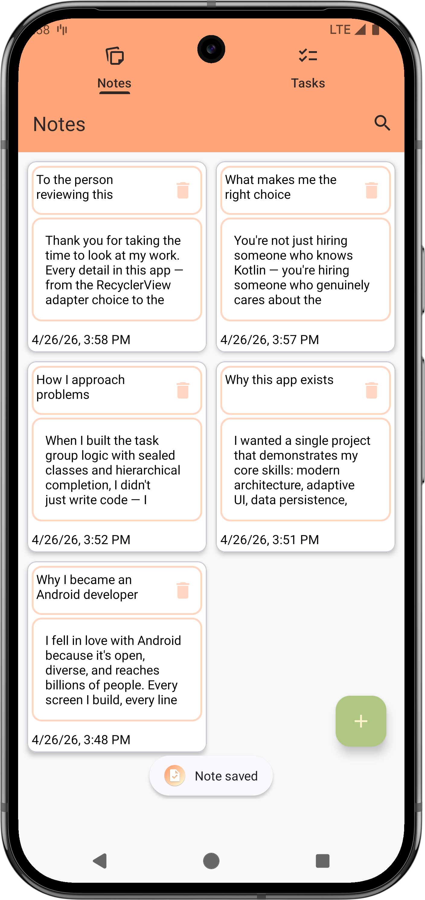 | 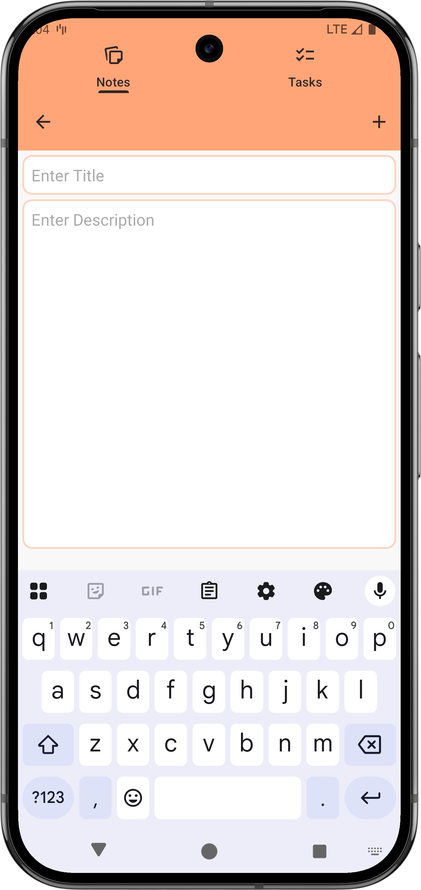 |

| Edit Note Dark| Search |
|:---:|:---:|
| 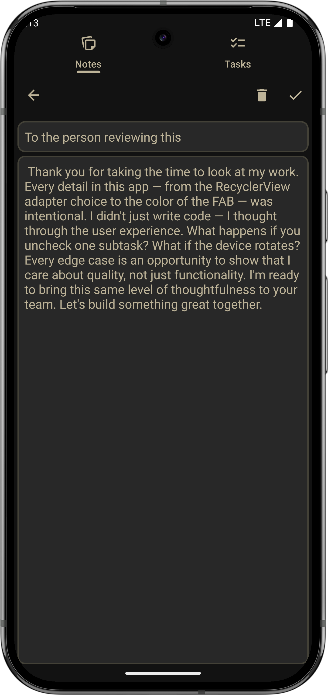 | 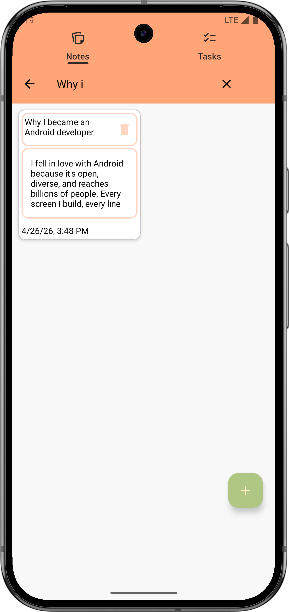 |

| Undo Snackbar |
|:---:|
|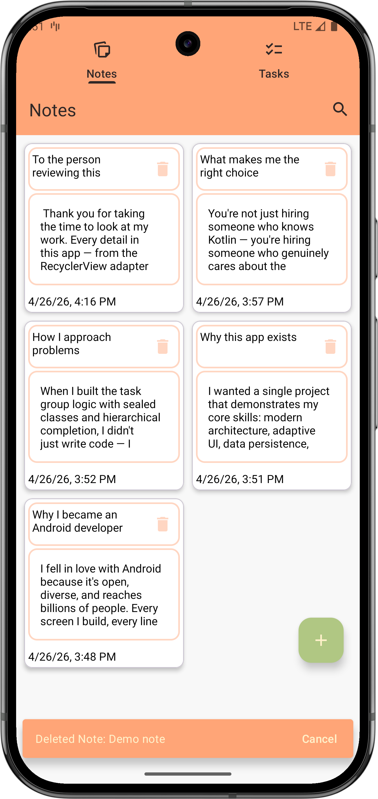 |

### Tasks

| Create Task Group with Subtasks | Edit Single Task |
|:---:|:---:|
| 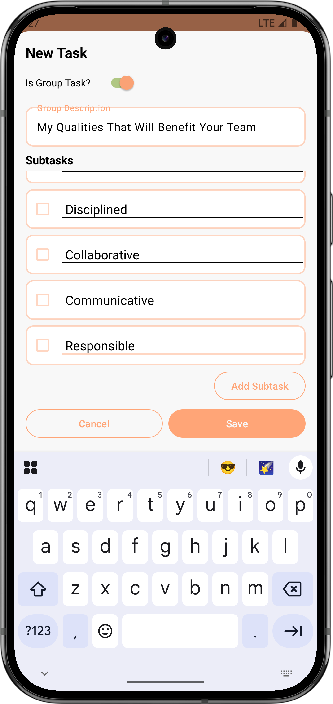 | 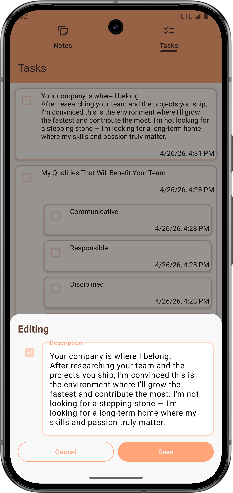 |

| Sort Demo | Discard Dialog |
|:---:|:---:|
| 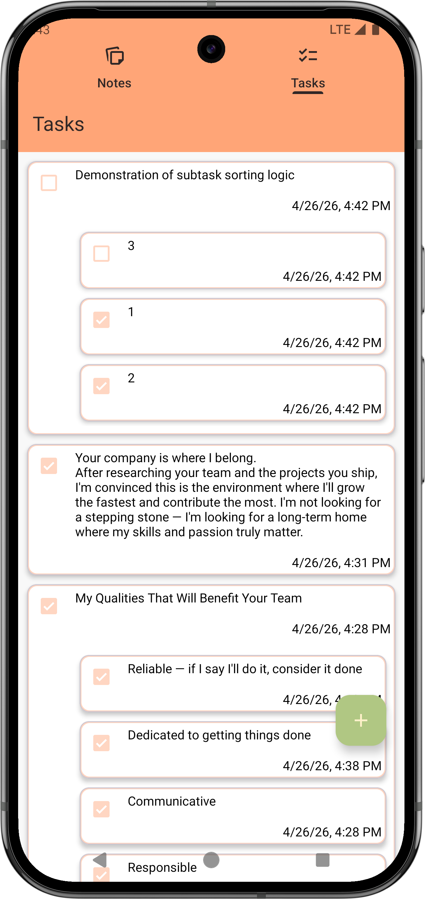 | 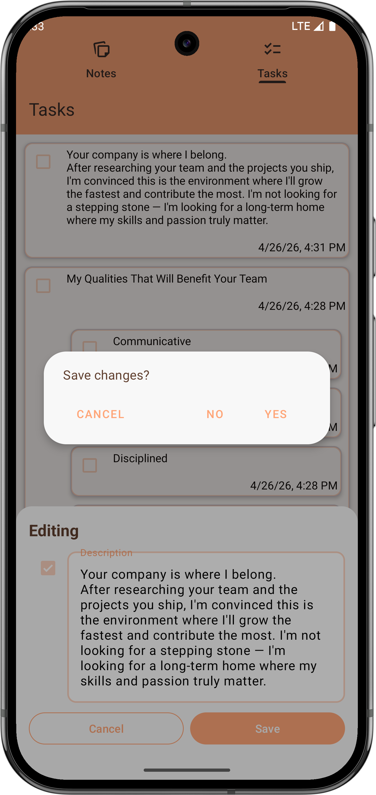 |

### Dark Theme & Landscape

| Dark Theme Note | Dark Theme Group Task |
|:---:|:---:|
| 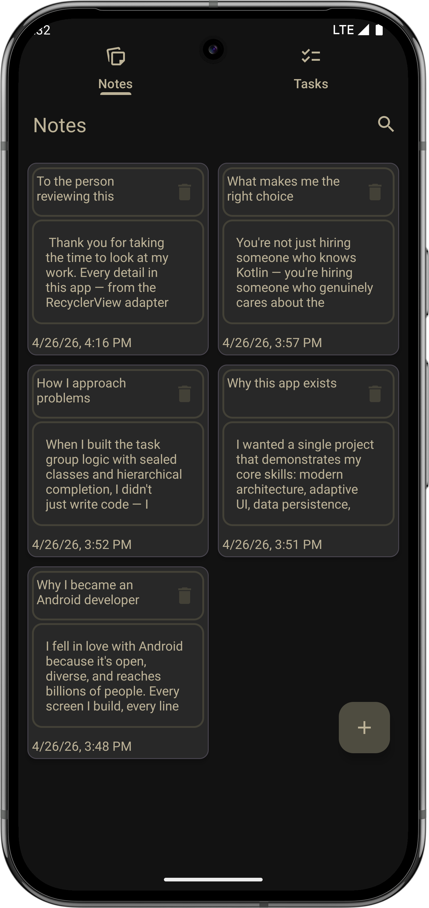 | 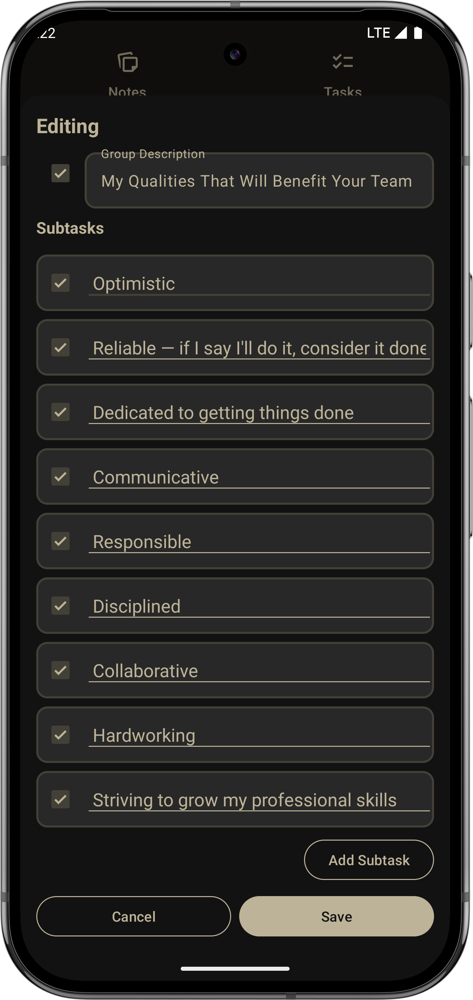 |

| Landscape Dark Theme |
|:---:|
|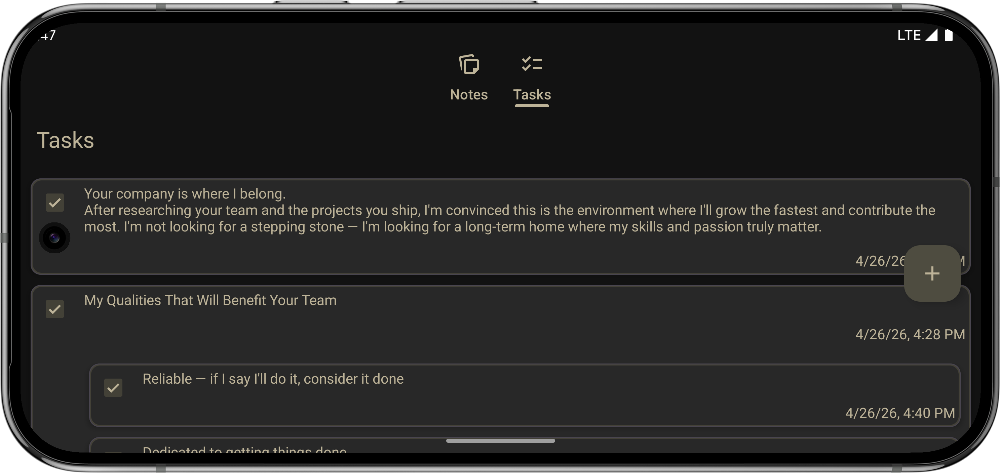 |


## 🛠️ Tech Stack & Architecture
| Technology | Purpose & Highlights |
|:---|:---|
| **Kotlin** | 100% Kotlin, utilizing Coroutines, Flow, and LiveData for robust asynchronous operations |
| **MVVM + Repository** | Clean separation of concerns with a clear architecture; ViewModels survive config changes |
| **Room Database** | Type-safe local storage with `Flow` and `LiveData` for reactive and lifecycle-aware data observation |
| **LiveData & Flow** | Demonstrated proficiency in both `LiveData` and `Flow` for different data observation scenarios. |
| **Navigation Component** | Single-activity architecture with type-safe navigation |
| **View Binding** | Null-safe, type-safe view access, eliminating the need for `findViewById` |
| **ViewPager2 & TabLayout** | Smooth tab navigation (Notes/Tasks) via icon taps and swipe gestures |
| **Edge-to-Edge** | Proper system bar insets handling across API 21–35, status bar and navigation bar padding, ensuring content is never obscured |
| **Two Adapter Types** | `ListAdapter` with DiffUtil for modern, efficient list updates AND `RecyclerView.Adapter` for and manual control — showing adaptability and demonstrating proficiency in both |
| **FragmentResultApi** | Decoupled, modern communication between fragments via `FragmentResultListener` |
| **Sealed Classes** | `TaskItem` sealed class for type-safe handling of single tasks and task groups with subtasks |
| **Fragment Arguments** | `Bundle` with `requireArguments()` for type-safe data passing and state restoration |
| **State Restoration** | `savedInstanceState` for seamless recovery of transient UI state |
| **Localization** | Multilingual support with `strings.xml` for English and Russian; ready for easy expansion to other locales |
| **Material Design 3** | Dynamic theming with full support for light and dark modes |

## 🧠 Key Architectural Decisions

### ⚙️ Flexible Data Persistence
Two different saving approaches are intentionally used to demonstrate versatility:
- **`TaskEntryBottomSheetDialog`:** Saves data via a direct callback listener — a classic, straightforward approach for simple scenarios.
- **`TaskEditBottomSheetDialog`:** Uses a shared `FormViewModel` for UI state and `FragmentResultApi` to notify the parent fragment. This shows a modern, lifecycle-aware architecture.

### 🧩 Smart Task Logic (Sealed Class & Checkbox Hierarchy)
- **Sealed Class `TaskItem`:** Models the one-to-many relationship between single tasks and task groups with subtasks in a type-safe way.
- **Intelligent Sorting:** Incomplete items are always sorted to the top, completed ones to the bottom.
- **Hierarchical Completion:**
    - Marking all subtasks as "done" automatically checks the parent task group.
    - Checking a task group as "done" automatically checks all its subtasks.
    - Unchecking a single subtask automatically unchecks the parent group, ensuring consistent and predictable logic.
### 🎨 UI/UX & RecyclerView Polish
- **Bottom Offset Drawing:** Using `clipToPadding="false"`, custom offsets are applied to the bottom of `RecyclerView` lists. This ensures the last item is not obscured by FAB or system navigation bar, remaining fully visible and interactive.
- **Dual Adapter Patterns** (`ListAdapter`, `RecyclerView.Adapter`): This demonstrates adaptability and proficiency in both modern and legacy approaches.
    - **`ListAdapter`** is used to demonstrate modern lists with DiffUtil for efficient updating.
    - **`RecyclerView.Adapter`** is used to demonstrate manual control of list updating.
- **`TextWatcher` Placement for Subtasks** : Showcases different customization options for EditText handling.
    - In some adapters, `TextWatcher` is set in the `bind()` function of the `ViewHolder`.
    - In others, it's instantiated in the `init{}` block of the `ViewHolder`, demonstrating awareness of performance nuances.
- **Adaptive EditText:** In the task creation/editing bottom sheet, the number of lines for the group task description `EditText` dynamically adjusts based on screen orientation. More lines are displayed in portrait mode to efficiently use available vertical space, while fewer lines are used in landscape mode to keep the interface clean and uncluttered. This is handled via `resources.configuration.orientation` check.
- **Keyboard-Aware Content Padding:** When the soft keyboard appears, the content area dynamically adjusts its bottom padding to ensure no UI elements are obscured. This is handled by observing `WindowInsets` changes and applying corresponding insets.
### 🛡️ Robust Data Loss Prevention
- **Back Press Handling:** Custom `OnBackPressedDispatcher` callbacks and toolbar "Up" button overrides prevent accidental data loss during note/task creation or editing.
- **Bottom Sheet Dismissal:** Touching outside the `BottomSheetDialog` does not dismiss it without confirmation, preventing unintentional closure.
- **Delete Confirmations:** All deletions are guarded by `DialogFragment`-based `AlertDialog` confirmations.
- **Undo Action:** Deleting a note from the main list shows a `Snackbar` with an "Undo" option for quick recovery.
### ✅ Robust Dialogs
- **`DialogFragment` for All Dialogs:** Every alert dialog (delete confirmation, etc.) is a `DialogFragment`, ensuring they survive configuration changes and maintain a consistent user experience.
- **Centralized Event Handling:** All `DialogFragment`s use `FragmentResultApi` to send results back, allowing the parent fragment to handle the outcome in a decoupled way.
### 🔍 Search
- **`SearchView` Integration:** A `SearchView` in the toolbar for the fragment with the full list of Notes allows real-time filtering of notes by their content.
### 🌍 Localization & Formatting
- **Multilingual Support:** All string resources are provided in two languages: standard English and Russian. Adding a new locale is straightforward by creating an additional `strings.xml` in the corresponding `values-*` directory.
- **Adaptive Date/Time Formatting:** Dates and times are formatted using `DateTimeFormatter.ofLocalizedDateTime()` with the device's system locale. This ensures automatic format adaptation — US devices display "12/31/2023, 2:30 PM" while European devices show "31.12.2023, 14:30" without any manual locale switching code.

## 🚀 Setup & Installation

1. Clone the repository:
    ```bash
    git clone https://github.com/Elige23/My-Note.git
    ```
2. Open the project in Android Studio
3. Sync Gradle files
4. Run on emulator or physical device
 
 🔗 **Repository:** [github.com/Elige23/My-Note](https://github.com/Elige23/My-Note)


## 📄 License
This project is licensed under the MIT License — see the [LICENSE](LICENSE) file for details.

## 📞 Contact
- **Email:** kazlova.viktoryia@gmail.com
